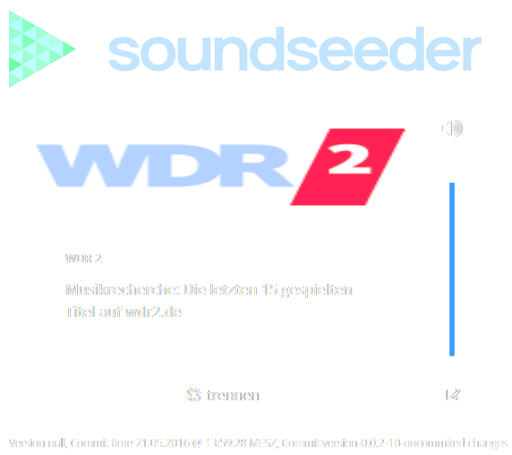

# soundseeder Speaker UI

[soundseeder](http://soundseeder.com/) is a wireless audio system application. Music can be played simultaneously by several devices controlled by the soundseeder application. One device is the streaming master, all other devices are speakers.

Non-Android devices are always speakers. soundseeder itself provide a Java application without any user interface for this purpose. This application uses the provided JAR and adds a simple user interface.

## Plaging view


## Disconnected view


## Configuration view


The current implementation is in alpha status. It works, but under the hood there remains some work.

# Requirements

To run the soundseeder Speaker UI your device needs to comply with the requirements:

- installed Oracle Java 1.8
- attached to a Network (W-LAN or LAN)
- Soundcard

# Installation / startup 

Download the soundseeder-speaker-ui.jar and execute it on the device you want to use as speaker using

```
java -jar soundseeder-speaker-ui.jar
```

After that use a browser of your choice and open [http://localhost:8080](http://localhost:8080) (in case you started the soundseeder Speaker UI on your computer).

## Installation as a Linux service

The soundseeder Speaker UI is a Spring-Boot application. To install the application as a Linux / Windows service, just follow the instruction in the [Spring-Boot documentation](https://docs.spring.io/spring-boot/docs/1.3.1.RELEASE/reference/html/deployment-install.html).

# Build sources

soundseeder Speaker UI is a Java application using Maven as buildtool. To compile the sources you need:

- installed Oracle Java JDK 1.8+
- installed and configured Apache Maven 3+
- downloaded sources
- installed soundseederspeaker.jar in local Maven repository

## Install soundseederspeaker.jar locally in Maven repository

Open a console and navigate to the lib folder. Run

```
mvn install:install-file -Dfile=soundseederspeaker.jar -DgroupId=com.soundseeder -DartifactId=soundseeder-speaker -Dversion=0.4.2.beta -Dpackaging=jar
```

to install the soundseederspeaker.jar locally in your Maven repository.

## Compile the sources

Open a console and navigate to the root folder of soundseeder-speaker-ui and run

```
mvn clean package
```

Sources are compiled and a JAR containing a runnable application is created in the target folder.

## Custom coding

Coding can be done in your favorite Java IDE. As this application uses [Projekt Lombok](https://projectlombok.org/) for generated Getters/Setters etc. it needs to be installed in your IDE, otherwise you get compilation errors.  